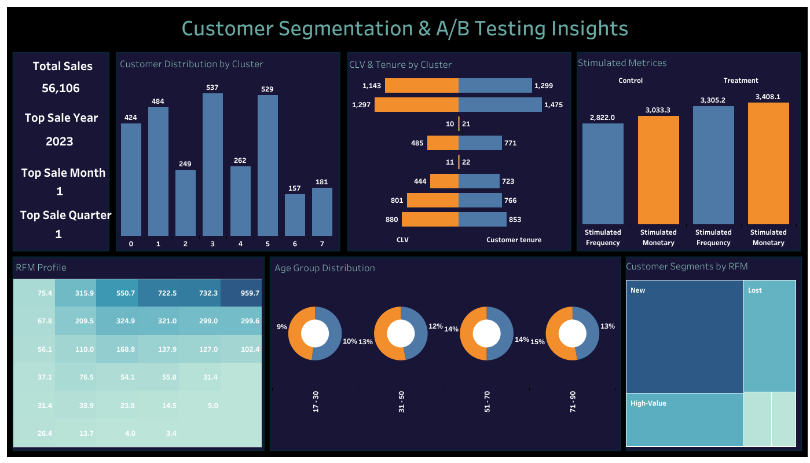

# Customer Segmentation & Campaign Effectiveness: A Data-Driven Analysis

## Project Summary  
This project provides actionable insights into customer behavior, segmenting the audience into meaningful groups and analyzing the effectiveness of marketing campaigns. The analysis leverages data-driven methodologies to answer key business questions, including customer profitability, campaign ROI, and purchasing trends. Using Python, R, and Tableau, the focus is on optimizing marketing strategies, budget allocation, and customer retention to drive growth and profitability.

---

## Business Questions Addressed
1. **Who are the most valuable customers?**
   - Utilize RFM (Recency, Frequency, Monetary value) analysis to identify high-value customer segments and prioritize retention strategies.  
2. **What is the impact of the 20% discount campaign?**
   - Assess the performance of the promotional campaign using A/B testing to understand its impact on customer engagement and revenue.  
3. **How can we segment our customers for tailored marketing?**
   - Apply clustering techniques to segment customers into actionable groups, enabling targeted and personalized marketing efforts.  
4. **What seasonal and temporal trends can inform inventory and marketing?**
   - Analyze sales patterns across different timeframes to optimize inventory planning and align marketing campaigns with peak purchasing periods.  
5. **How can demographic data improve customer retention?**
   - Leverage demographic data to refine marketing approaches, enhance personalization, and increase customer loyalty.

---

## Data Overview
- **Source**: Custom-generated retail sales dataset (2020-2023) with 10,000 transaction records.  
- **Key Features**: Transaction date, customer demographics, purchase details, and campaign interactions.  
- **Preparation**: Data cleaning, feature engineering (RFM metrics), and clustering preparation using Python.  

---

## Key Business Metrics
- **Customer Lifetime Value (CLV)**: Estimated profitability of customer segments.  
- **Sales Impact**: Quantified lift in revenue due to campaigns.  
- **Engagement Rates**: Frequency of transactions by customer clusters.  
- **Seasonality Trends**: Revenue patterns across different time periods.  

---

## Analysis Summary
1. **Customer Segmentation**:
   - Used K-means clustering to group customers into actionable segments:
     - **High-value customers**: 25% of revenue, focus on loyalty programs.  
     - **Low-engagement customers**: Opportunities for reactivation campaigns.  

2. **Campaign Effectiveness (A/B Testing)**:
   - Conducted hypothesis testing to assess the impact of a 20% discount:
     - Results showed a **15% increase in sales** among the test group.  
     - Campaign drove higher engagement but lowered average profit per sale.  

3. **Seasonal Trends**:
   - Peak sales observed in November-December, aligning with holiday seasons.
   - Off-peak discounts in March-April effectively smoothed revenue dips.

4. **Demographic Insights**:
   - Higher spending observed in customers aged 30-45, with income levels $60k+.  
   - Female customers showed higher engagement with promotional offers.

---

## Recommendations
1. **Focus on High-Value Customers**:  
   - Implement loyalty programs to retain and grow the most profitable segments.  

2. **Optimize Promotions**:  
   - Target campaigns toward segments responsive to discounts, avoiding over-discounting for high-profit groups.  

3. **Capitalize on Seasonality**:  
   - Increase inventory and marketing budgets during holiday periods.  

4. **Personalize Marketing**:  
   - Use demographic data for tailored outreach, focusing on age and income-based strategies.  

5. **Continuous Monitoring**:  
   - Use CLV and churn indicators to dynamically adjust customer strategies.

---

## Tools and Technologies  
- **Data Analysis**: Python (Pandas, NumPy, Matplotlib, Seaborn), R (stats, ggplot2).  
- **Clustering and Segmentation**: K-means clustering, RFM analysis.  
- **Visualization**: Tableau Dashboard.  
- **Statistical Testing**: Hypothesis testing and A/B testing in Python and R.  

---

## Next Steps
1. Integrate real-time data streams to enhance predictive modeling.  
2. Expand demographic features to include psychographic factors for deeper insights.  
3. Explore advanced models for campaign optimization.
